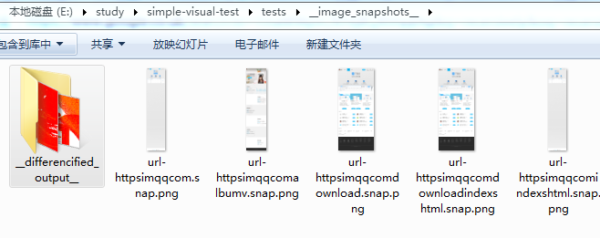

# simple visual test

make visual test simple | 让显示测试更简单

simple path | 最简使用

```
git clone https://github.com/postor/simple-visual-test.git
cd simple-visual-test
npm install
node generate.js --crawl=https://im.qq.com/
npm run update

# run this every day and get the change when it happen | 每天运行这一段就能获得网站的显示更新
sudo crontab -e
# 30 3 * * * cd /path/to/project && node cron-job.js
```


## prepare | 准备

```
git clone https://github.com/postor/simple-visual-test.git
cd simple-visual-test
npm install
```
if you are inside GFW, you may have problem installing puppeteer, you need to | 如果在国内，可能是没法正常安装puppeteer的，你需要:

- set environment varible  `PUPPETEER_SKIP_CHROMIUM_DOWNLOAD` to `true` | 设置环境变量 `PUPPETEER_SKIP_CHROMIUM_DOWNLOAD` 为 `true`
- add a `launch.json` in `simple-visual-test` folder and set value `executablePath` to your chrome.exe path | 在 `simple-visual-test` 目录下增加 `launch.json` 文件，并设置 `executablePath` 的值为你的 chrome.exe 的完整路径

launch.json, you can add other launch options refer https://github.com/GoogleChrome/puppeteer/blob/master/docs/api.md#puppeteerlaunchoptions 

launch.json, 你可以添加其他的启动参数，参考 https://github.com/GoogleChrome/puppeteer/blob/master/docs/api.md#puppeteerlaunchoptions 

```
{
  "executablePath":"C:\\Users\\josh\\AppData\\Local\\Google\\Chrome SxS\\Application\\chrome.exe",
}
```

## generate config | 生成配置

you can generate through `node generate.js --crawl=[baseUrl]`, this will recursively crawl the page and fill config with links under the baseUrl 

你可以通过`node generate.js --crawl=[baseUrl]`来生成配置，它会自递归动抓取页面中的链接并将域下的链接填入配置

```
node generate.js --crawl=https://im.qq.com/
```

or you know urls to test, then just write `tests/config.json` like

或者自己写一个`tests/config.json`

```
{
  "urls":["https://im.qq.com/"]
}
```

on linux you may run into problems launching chrome, you may need libs installed | 在linux上可能需要一些库来运行chrome

```
sudo apt-get install -yq gconf-service libasound2 libatk1.0-0 libc6 libcairo2 libcups2 libdbus-1-3 \
libexpat1 libfontconfig1 libgcc1 libgconf-2-4 libgdk-pixbuf2.0-0 libglib2.0-0 libgtk-3-0 libnspr4 \
libpango-1.0-0 libpangocairo-1.0-0 libstdc++6 libx11-6 libx11-xcb1 libxcb1 libxcomposite1 \
libxcursor1 libxdamage1 libxext6 libxfixes3 libxi6 libxrandr2 libxrender1 libxss1 libxtst6 \
ca-certificates fonts-liberation libappindicator1 libnss3 lsb-release xdg-utils wget
```
and if you are using root , a launch config is needed, launch.json | 如果你使用root账号还需要配置launch参数

```
{
  "args": ["--no-sandbox"]
}
```


## update snapshots | 更新截图

```
npm run update
```

you can use your design replace images in `tests\__image_snapshots__` and perform TDD

或者你可以用你的设计图替换 `tests\__image_snapshots__` 中的图片，来实现TDD

## test | 运行测试

```
npm run test
```

